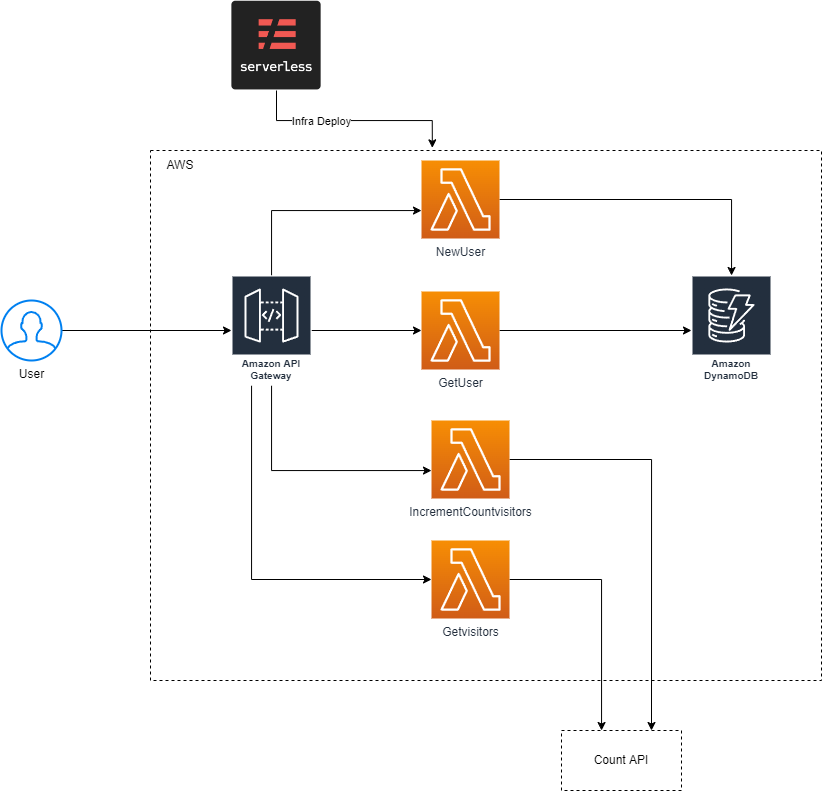

# ton-challenge



# Install

start with clone of project in your machine.
create a repository and clone the project

```
git clone 'project'
```

install all dependencies with npm or yarn
```
npm install
```
Build project with package script
```
npm run build
```
# Execute
You can execute all lambdas with serveless local invoker like 
```
serverless invoke local --function create --data "{\"body\":{\"name\":\"mateus\", \"email\":\"mateus@gmail.com\"}}
```
or you can deploy in your aws account with 
```
serverless deploy --stage dev
```

# Routes
## add visit to web site counter
POST /count
## get visits of the web site 
GET /count
## create a user 
POST /users
<br>body: 
```
{
    "name": "ana",
    "email": "ana@gmail.com"
}
```
## get user info
GET /users?id=hash
